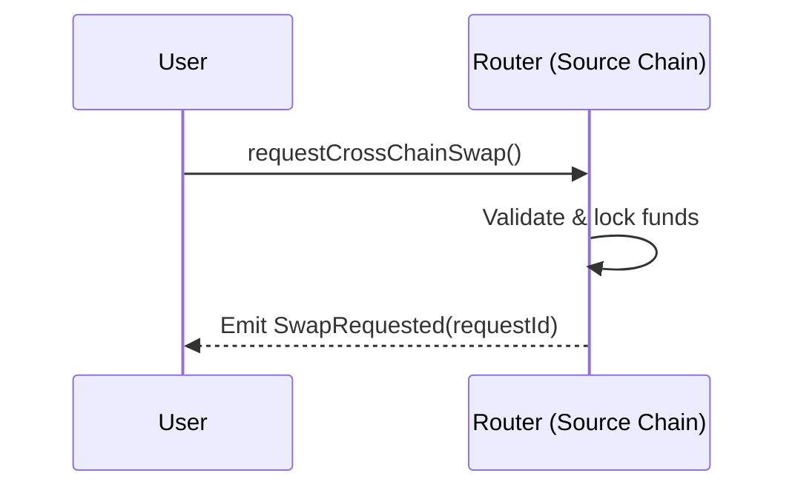
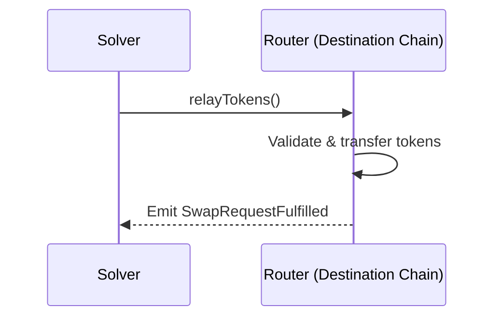
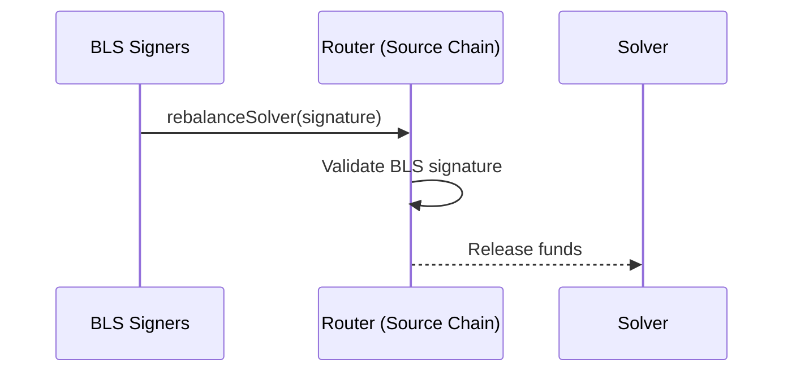
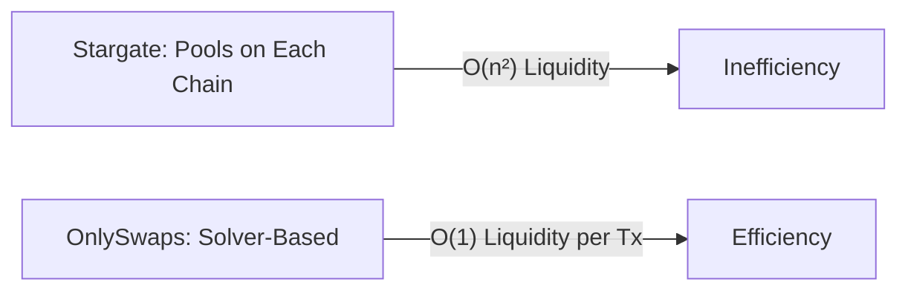
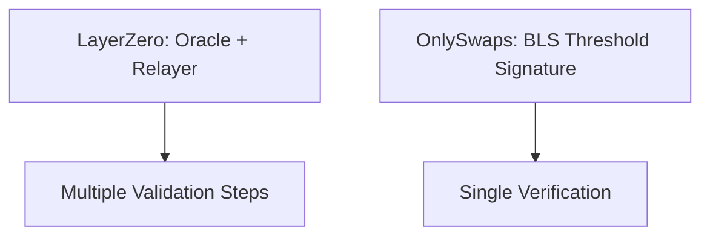

# OnlySwaps Cross-Chain Architecture: Threshold-Signed, Solver-Filled Cross-Chain Settlement

## Overview

OnlySwaps is a next-generation cross-chain token transfer protocol designed to enable seamless, secure, and efficient movement of tokens across multiple blockchain networks. Unlike traditional bridging solutions, OnlySwaps leverages a **solver-based architecture** and **BLS (Boneh-Lynn-Shacham) threshold signature verification** to deliver a decentralized, capital-efficient, and cryptographically robust cross-chain experience.

---

## Core Architecture

### 1. Smart Contract Components

#### Router Contract
The Router is the protocol's central orchestrator, responsible for:
- Initiating and tracking cross-chain swap requests
- Managing token mappings and compatibility across chains
- Handling solver rebalancing and compensation
- Collecting and distributing protocol and solver fees
- Enabling request cancellation and user refunds

#### ScheduledUpgradeable Contract
A robust upgrade mechanism that ensures:
- Time-delayed contract upgrades, authorized via BLS threshold signatures
- Enforced minimum upgrade windows for security
- Cancellable upgrades with multi-signer authorization
- Version-controlled contract implementations to prevent downgrade attacks

#### BLSBN254SignatureScheme Contract
The cryptographic engine for BLS signature verification, featuring:
- BN254 elliptic curve implementation for 128-bit security
- Domain separation to prevent replay attacks
- Threshold signature verification for decentralized authorization
- Application-specific signature schemes (e.g., `swap-v1`, `upgrade-v1`)

---

### 2. How OnlySwaps Works

#### Step 1: Swap Request Initiation

```solidity
function requestCrossChainSwap(
    address tokenIn,
    address tokenOut,
    uint256 amount,
    uint256 solverFee,
    uint256 dstChainId,
    address recipient
) external returns (bytes32 requestId)
```

**Process:**
1. User submits a swap request on the source chain.
2. Router validates token mapping and chain support.
3. Protocol fee is calculated and deducted.
4. Total amount (swap + solver fee) is locked in the Router; a portion is reserved for BLS operations.
5. Unique `requestId` is generated and stored.
6. `SwapRequested` event is emitted for off-chain monitoring.

**Diagram: Swap Request Flow**



---

#### Step 2: Solver Fulfillment on Destination Chain

```solidity
function relayTokens(
    address solverRefundAddress,
    bytes32 requestId,
    address sender,
    address recipient,
    address tokenIn,
    address tokenOut,
    uint256 amountOut,
    uint256 srcChainId,
    uint256 nonce
) external
```

**Process:**
1. Solvers monitor `SwapRequested` events across chains.
2. Solver validates request parameters and profitability.
3. Router reconstructs and validates the original `requestId`.
4. Solver calls `relayTokens` on the destination chain Router.
5. Solver's tokens are transferred to the recipient.
6. Transfer receipt is stored with solver's refund address.
7. `SwapRequestFulfilled` event is emitted.

**Diagram: Solver Fulfillment Flow**



---

#### Step 3: Solver Rebalancing on Source Chain

```solidity
function rebalanceSolver(
    address solver,
    bytes32 requestId,
    bytes calldata signature
) external
```

**Process:**
1. Off-chain BLS threshold signers monitor fulfilled transfers.
2. Signers generate a BLS signature over swap parameters + solver address.
3. Anyone can call `rebalanceSolver` with a valid BLS signature.
4. Router validates the BLS signature.
5. Solver receives `amountOut + solverFee` from locked funds.
6. Protocol fee remains in Router as revenue.

**Diagram: Solver Rebalancing Flow**



---

### 3. BLS Signature Security Model

#### Threshold Signatures

- Validators hold shares of a BLS key.
- A threshold (e.g., 5 of 9) is required for authorization.
- Signatures are aggregated off-chain for efficiency.
- Single on-chain verification regardless of threshold size.

#### Message Construction

```solidity
function swapRequestParametersToBytes(bytes32 requestId, address solver)
    returns (bytes memory message, bytes memory messageAsG1Bytes)
```

- BLS signature covers solver address, swap parameters, chain IDs, and nonce.
- Prevents signature theft and replay attacks.

#### Domain Separation

- Unique Domain Separation Tags (DST) for each signature context.
- `"swap-v1"` for swap validation, `"upgrade-v1"` for upgrades.
- Includes chain ID and contract version to prevent misuse.

---

## Advantages Over Existing Solutions

### Compared to Stargate Finance (Pool-Based Model)

#### Stargate's Pool Model Limitations:
1. **Liquidity Fragmentation**: Requires pre-funded liquidity pools on each chain, leading to capital inefficiency.
2. **Slippage Risk**: Large transfers can cause significant slippage due to AMM-style pools.
3. **Capital Inefficiency**: Millions in idle liquidity across chains, resulting in low utilization.
4. **Delta Algorithm Complexity**: Complex rebalancing mechanisms increase operational overhead.
5. **Governance Overhead**: Continuous management of pool parameters.

#### OnlySwaps Advantages:
1. **Just-in-Time Liquidity**: Solvers provide liquidity only when profitable, eliminating protocol-custodied idle capital.
2. **Zero Slippage**: Like-for-like token transfers at exact exchange rates.
3. **Capital Efficiency**: No need for pre-funded pools.
4. **Market-Driven Fees**: Solver competition optimizes fees.
5. **Simplified Governance**: Focus on security, not liquidity management.

**Diagram: Liquidity Comparison**



---

### Compared to LayerZero (Oracle + Relayer Model)

#### LayerZero's Dual Proof Limitations:
1. **Trust Assumptions**: Relies on honest oracles and relayers.
2. **Centralization Risk**: Limited oracle/relayer diversity.
3. **Complexity**: Requires coordination between multiple entities.
4. **Cost**: Dual verification increases transaction costs.
5. **Latency**: Multiple validation steps slow settlement.

#### OnlySwaps Advantages:
1. **Cryptographic Security**: BLS signatures provide mathematical guarantees.
2. **Decentralized Validation**: Threshold signatures from distributed validators.
3. **No Oracles Needed**: Eliminates reliance on external data feeds.
4. **Reduced Complexity**: Single signature verification.
5. **Lower Costs**: Efficient BLS verification.
6. **Faster Settlement**: Direct solver fulfillment.

**Diagram: Validation Comparison**



---

### Technical Superiority

#### 1. Security Model

```
Traditional Bridges: Multi-sig or Oracle + Relayer
OnlySwaps: BLS Threshold Signatures
```

- **BLS Signatures**: Secure, aggregatable, and efficient.
- **Threshold Security**: No single point of failure.
- **Domain Separation**: Prevents signature reuse.
- **Nonce Protection**: Eliminates replay attacks.

#### 2. Economic Efficiency

```
Liquidity Scaling Comparison

Pool Models: O(n²) liquidity requirements for n chains
OnlySwaps: O(1) solver liquidity per transaction
```

- **Pool-Based Bridges**: Quadratic growth in liquidity requirements as chains increase.
- **OnlySwaps Solver Model**: Linear, just-in-time liquidity for each swap.

#### 3. Operational Simplicity

```
LayerZero: Oracle + Relayer + Block Validation + Merkle Proofs
OnlySwaps: Single BLS Signature Verification
```

- **Single Verification**: One BLS signature check.
- **No External Dependencies**: Self-contained logic.
- **Simplified Integration**: Standard ERC-20 operations.

---

## Implementation Details

### Token Mapping System

```solidity
mapping(address => mapping(uint256 => EnumerableSet.AddressSet)) private tokenMappings;
```

- **Flexible Mappings**: One-to-many token mapping across chains.
- **Admin Controlled**: Secure management of token pairs.
- **Unlimited Compatibility**: Supports any number of chains.

### Fee Structure

```solidity
function getVerificationFeeAmount(uint256 amountToSwap) 
    returns (uint256 verificationFee, uint256 amountOut)
```

- **Protocol Fee**: Capped at 50% max.
- **Solver Fee**: Market-driven.
- **Admin Withdrawal**: Protocol fees can be withdrawn by admin.

### Request Lifecycle Management

```solidity
// Unfulfilled requests can be cancelled after window
function stageSwapRequestCancellation(bytes32 requestId) external;
function cancelSwapRequestAndRefund(bytes32 requestId, address refundRecipient) external;
```

- **User Protection**: Cancel unfulfilled requests after a time window (default: 1 day).
- **Full Refunds**: Users receive all funds back.
- **Emergency Exits**: Protection against solver unavailability.

### Upgrade Governance

```solidity
function scheduleUpgrade(
    address newImplementation,
    bytes calldata upgradeCalldata,
    uint256 upgradeTime,
    bytes calldata signature
) external
```

- **Time Delays**: Minimum 2-day upgrade windows.
- **BLS Authorization**: Threshold signatures required.
- **Cancellable**: Upgrades can be cancelled.
- **Version Control**: Prevents downgrade attacks.

---

## Security Considerations

### 1. BLS Signature Validation

- **Curve Security**: BN254 curve, 128-bit security.
- **Threshold Safety**: Configurable signer threshold.
- **Key Rotation**: Validators can be updated with signatures.

### 2. Economic Security

- **Solver Incentives**: Paid only after successful fulfillment.
- **Fee Adjustments**: Users can increase fees for unfulfilled requests.
- **Cancellation Rights**: Users protected against solver unavailability.

### 3. Smart Contract Security

- **Upgradeability**: UUPS proxy pattern with time delays.
- **Access Control**: Role-based permissions.
- **Reentrancy Protection**: Guards on state-changing functions.

---
### Trust Model Summary

- **Users → Committee:** Users trust their **chosen BLS committee** (t-of-n) to attest that a destination fulfillment occurred with the agreed parameters. No pooled TVL and user funds remain locked on the source chain until authorization.
- **Solvers → Committee Liveness:** Solvers trust committee **liveness** to authorize rebalancing in a timely manner after they advance liquidity on the destination chain.
- **Governance:** Upgrades and token mappings are **BLS-authorized** with a time delay and public DST-bound messages.
- **Self-Custody:** Funds remain in self-custodial contracts; there is **no centralized custodian** and no omnibus pool that can be frozen or drained.
- **Receipts:** Each request produces a verifiable on chain signature.
## Conclusion

OnlySwaps represents a paradigm shift in cross-chain token transfer architecture. By combining BLS threshold signatures with a solver-based fulfillment model, it addresses the fundamental limitations of both pool-based systems (like Stargate) and oracle-dependent solutions (like LayerZero).

**Key Innovations:**
1. **Cryptographic Security**: BLS signatures provide mathematical guarantees.
2. **Economic Efficiency**: Just-in-time liquidity eliminates capital requirements.
3. **Operational Simplicity**: Single signature verification replaces complex validation.
4. **Decentralized Architecture**: Threshold signatures eliminate single points of failure.
5. **Developer-Friendly**: Standard ERC-20 operations with familiar interfaces.

As the multi-chain ecosystem evolves, OnlySwaps provides the infrastructure for seamless, secure, and efficient cross-chain value transfer that scales with the growing demands of decentralized finance.
